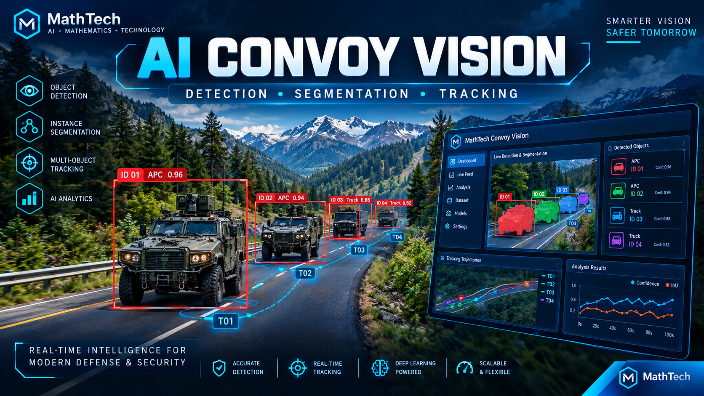

# MathTech Convoy Vision — v1.1.0

**Vehicle detection, instance segmentation, tracking and visual analytics**  
Developed by **Shivam Singh, Founder of MathTech**  
**I HAVE NO LIMITATION**

A complete, self-hosted, single-node application based on your dashboard reference. It includes the backend, offline dashboard, trained model weights, SQLite database schema, training/evaluation utilities, launchers, tests and Docker deployment files. The screens use real API data. No hardcoded detection results are substituted when a model is unavailable.


## Upgrade an existing installation

This update fixes the sampled-JPEG playback stalls and improves vehicle motion analysis. Stop the old server. Extract the new ZIP separately, then copy its program files into your existing application folder, keeping your **`.env`, `data/`, and `.venv/`**. Run your usual launcher again; it installs the new FFmpeg dependency automatically. Hard-refresh the dashboard (**Ctrl+Shift+R**). Select your uploaded video and start a **new analysis**: old saved results retain the previous tracking measurements.

See [docs/UPGRADE.md](docs/UPGRADE.md). The ZIP contains model weights and source; it does not contain your private data or passwords.

## Start in five minutes

Install **Python 3.12**. Python 3.11–3.13 are supported; validation was performed with Python 3.12 on Linux. Internet is needed once to install dependencies; the model is already included.

**Windows**

1. Extract this ZIP completely.
2. Double-click `start_windows.bat` (or run it from PowerShell).
3. Choose an administrator password of at least 12 characters when prompted.
4. Open **http://localhost:8000** and sign in as **admin** with your chosen password.

**Linux / macOS**

```bash
cd MathTech-Convoy-Vision-v1.1.0
bash start.sh
```

The launcher creates `.venv`, installs the pinned runtime and starts the server. On later launches it reuses the database and password. Stop it with Ctrl+C. No Node.js, npm build or external CDN is needed.

**First real run**

1. In Dashboard, click **Browse** and upload `samples/vehicle-validation.mp4` or your own road video.
2. Select **YOLOv8 Nano**, **Detection + Segmentation**, confidence **0.30**, and analysis FPS **5**.
3. Click **Run Analysis**. Non-browser codecs are prepared once for smooth H.264 playback. Video plays continuously; masks and tracks are aligned to video time. Source-time model observations generate mask area, motion and confidence charts.
4. Open **Analysis** to replay the video with persisted observations, inspect the summary or export CSV/JSON.
5. For live input, open **Live Feed → Enable camera → Analyze camera feed**, then click **Run Analysis** on Dashboard.

`samples/vehicle-validation.mp4` is a synthetic camera pan of Ultralytics' bus example image. **`samples/vehicle-motion-demo.mp4`** moves a bus cutout over a static synthetic background; its ground-truth motion is supplied in JSON. Both verify wiring and motion behavior; neither is a field dataset or accuracy benchmark.

**For slower PCs:** choose **Low-power CPU** in Controls. It limits analysis to at most 3 FPS and 640-pixel analysis images. Balanced uses 960 pixels; More detail uses 1280. Adaptive sampling is enabled by default and reserves processing headroom. The fixed bundled neural input remains 640×640; smaller analysis images reduce tracking, mask reconstruction and transport cost. Video playback FPS and inference sampling FPS are separate. Settings can disable adaptive sampling for reproducible offline processing.

## Working modules

| Module                   | Implemented behavior                                                                                                                                                    |
| ------------------------ | ----------------------------------------------------------------------------------------------------------------------------------------------------------------------- |
| Dashboard                | Original/overlay/trail views, mask output, counts, selectable track rows, mask area and live confidence plot                                                            |
| Video input              | Bounded upload, codec validation, one-time browser preparation, HTTP byte-range streaming, independent native playback, adaptive background analysis, pause/resume/stop |
| Live Feed                | Continuous browser webcam preview; timestamped JPEG inference messages, one in-flight frame, analyzed-frame archive and disconnect recovery                             |
| Detection + segmentation | Bundled YOLOv8n-seg ONNX; letterboxing, class-aware NMS, decoded instance masks and compressed contours                                                                 |
| Tracking                 | Global assignment, detection-seeded optical flow, camera-motion estimates, source-time velocity, movement state, direction arrows and short occlusion grace period      |
| Group status             | Explicit proximity/motion heuristic; background-relative motion when an affine fit is reliable                                                                          |
| Analysis                 | SQLite observations, bounded timeline windows, native video replay, interpolated overlays, summary, charts, CSV/JSON and snapshots                                      |
| Dataset                  | Source-frame selection, polygon annotations, negative samples, persistence and YOLO segmentation ZIP export                                                             |
| Models                   | Checksum verification, warmup, offline custom ONNX registration, training and held-out evaluation scripts                                                               |
| Settings                 | Persisted defaults; current runs retain their saved configuration                                                                                                       |
| Access                   | Hashed passwords, expiring HttpOnly cookie sessions, CSRF checks, admin/operator/viewer roles and user access revocation                                                |
| System health / logs     | Worker/storage status, audit events, error messages and filters                                                                                                         |
| Deployment               | One-command local setup, non-root container, resource limits, healthcheck and HTTPS proxy example                                                                       |

## What the model actually knows

The built-in COCO model is filtered to **car, bus, truck, motorcycle and bicycle**. It does **not** identify APCs, military affiliation, vehicle intent or geographic heading. The reference's APC/Jeep labels are not fabricated in the software. The masks segment **vehicle instances**, not road/background classes. This implementation uses the integrated YOLO segmentation head; it does not label that output as SAM.

All coordinates and motion are in the **analysis image**, resized with preserved aspect ratio to the chosen size (default 960 pixels, maximum 1280). Speeds are **pixels/second**. Downward is positive Y; image direction is clockwise from the rightward image axis. Reliable background feature matches provide optional camera-relative image velocity; the result explicitly reports when compensation is unavailable. Without camera calibration and telemetry, the system does not report meters, altitude, compass directions or real-world speed.

Aerial viewpoint, distance, occlusion, lighting and unfamiliar vehicles can cause missed or incorrect detections. Thresholds tune output filtering; confidence is not measured accuracy. Inference runs on sampled frames. Between real observations the display interpolates boxes and transforms the previous learned contour; brief predictions are labeled. If results lag too far, stale overlays clear while video continues. Archived camera sessions replay analyzed JPEGs rather than a full-rate camera recording. No aerial accuracy percentage, fixed FPS guarantee across hardware, or production certification is claimed. Field validation on your own held-out footage is required. See `docs/VALIDATION.md` for the checks performed on this package.

## Docker

```bash
cp .env.example .env
# Edit .env and set ADMIN_PASSWORD to a unique password (12+ characters).
docker compose up --build -d
docker compose logs -f vision
```

Open **http://localhost:8000**. Data is retained in the `vision-data` named volume. Docker setup is supplied but was not executed in the validation environment. For remote deployment use HTTPS, set `PUBLIC_ORIGIN=https://your-hostname` and `COOKIE_SECURE=true`, and adapt `deployment/nginx.conf`. Do not set secure cookies for plain localhost HTTP.

**Run exactly one Uvicorn worker.** The in-process manager coordinates worker slots and live sessions. Multiple Uvicorn processes or replicas need an external job queue, shared object storage and a different database architecture; this package does not silently pretend to support that configuration.

## Manual startup

```bash
python3 -m venv .venv
source .venv/bin/activate
python -m pip install -r requirements.txt
# Bash: choose your own value. Do not reuse this literal text.
export ADMIN_PASSWORD='Mathtechadmin@123'
#for windows
$env:ADMIN_PASSWORD="MathTech@Admin#2026!"
python -m uvicorn backend.app:app --host 127.0.0.1 --port 8000 --workers 1 --ws-max-size 4194304
```

In PowerShell use `.venv\Scripts\Activate.ps1` and `$env:ADMIN_PASSWORD = 'your-own-password'`. The direct Uvicorn command reads environment variables; the launchers and Docker Compose additionally load `.env`.

## Train on your own vehicle data

1. Upload multiple independent videos and annotate source frames in Dataset. Save each reviewed frame.
2. Export the dataset ZIP and extract it. Set `path` in `data.yaml` to that dataset's absolute directory. Add a real validation set if you only annotated one source.
3. Use a **separate training environment**, install matching PyTorch/torchvision, then `requirements-training.txt`.
4. Run `scripts/train.py`, evaluate the held-out split with `scripts/evaluate.py`, and register the exported ONNX file using `scripts/register_model.py`.

Complete commands, output requirements and dataset-split limitations are in `docs/MODELS.md`. Training, annotation and evaluation are real workflows, but this package has not trained a new aerial model or supplied invented experimental results.

## Test and maintain

```bash
python -m pip install -r requirements-dev.txt
python -m pytest -q
```

Stop the server before backup or password recovery:

```bash
python scripts/backup.py --output backups/vision-backup.zip
python scripts/reset_password.py --username admin
```

Restore by extracting the backup's `data/` folder into the stopped application's configured data location. Backup ZIPs contain uploaded images, media and authentication data; keep them private. `data/`, passwords and runtime logs are not part of the delivered source ZIP.

See `docs/ARCHITECTURE.md`, `docs/API.md`, `docs/DEPLOYMENT.md`, and `docs/TROUBLESHOOTING.md` for implementation and operations details.

## License and provenance

This distribution is **AGPL-3.0**; see `LICENSE`. Ultralytics model weights and training dependencies retain their licenses. Review `THIRD_PARTY_NOTICES.md` before commercial distribution or a closed-source deployment. Sources: [Ultralytics YOLOv8](https://docs.ultralytics.com/models/yolov8/), [segmentation](https://docs.ultralytics.com/tasks/segment/), [licensing](https://www.ultralytics.com/license).
