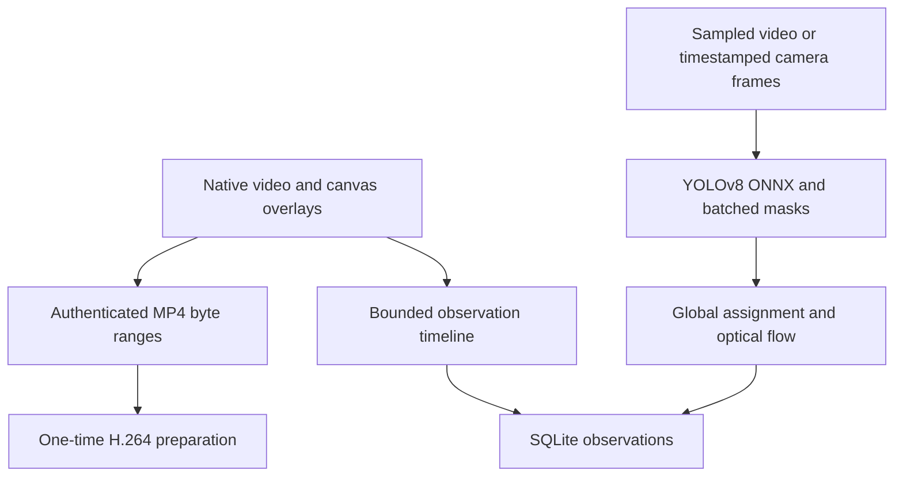

# Architecture

This is a single-node service with an offline, same-origin HTML/CSS/JavaScript dashboard and a FastAPI API. ONNX Runtime performs CPU inference. SQLite in WAL mode stores users, hashed sessions, media metadata, job configurations, per-frame predictions, source-frame annotations, settings and audit events.

## Playback and analysis clocks

The dashboard uses a native HTML video player for files and a direct MediaStream for live cameras. Browser decoding never waits for model inference. `requestVideoFrameCallback` synchronizes transparent overlay, segmentation and trajectory canvases to the same presented video frame. A requestAnimationFrame fallback is available. Tables and charts update at a lower cadence than the video.

On-demand preparation transcodes non-browser codecs, large clips and non-MP4 sources once into a bounded 1280-pixel H.264 MP4 with fast-start metadata. FFmpeg is supplied by the pinned platform-specific `imageio-ffmpeg` wheel. Preparation runs in a single background worker and its progress is exposed. The UI waits for preparation before starting analysis, avoiding simultaneous conversion/inference CPU pressure. Authenticated video responses support byte ranges for native seeking. File audio is muted/omitted in the prepared preview.

Timeline requests return at most 240 observations in a bounded future window; the browser retains at most 500 observations. Source timestamps choose neighboring model observations. Stable track IDs allow box interpolation and contour transforms between them. These are display estimates, labeled as interpolated; original mask contours, area, confidence and observations remain unchanged in SQLite/exports. When future observations are unavailable, prediction is bounded to 0.4 seconds for files (0.55 for live input), after which stale overlays are hidden. Playback continues. Adaptive sampling can produce larger observation gaps; interpolation uses those actual timestamps.

## Inference, tracking and coordinates

File decoding and inference run in a bounded thread pool. Frames fit the chosen analysis size (default 960, range 480–1280). The built-in neural input is always centered-letterboxed 640×640, normalized BGR→RGB. YOLO's static raw export returns `(1,116,8400)` predictions and `(1,32,160,160)` learned mask prototypes.

Postprocessing selects the highest-scoring class, filters generic vehicles, applies class-aware NMS, maps boxes out of the letterbox, and decodes selected masks with one batched OpenCV GEMM. Masks are cropped to boxes. True raster-mask area and compressed exterior/hole contours are persisted separately. OpenCV uses one thread; ONNX intra-op threads are configurable, inter-op is one, and idle spinning is disabled. This avoids thread oversubscription while playing video.

The tracker uses global Hungarian assignment, velocity-predicted boxes and compatible vehicle classes. Sparse Lucas–Kanade features within each previous vehicle mask are seeded with the associated detection displacement, then checked by forward/backward consistency and residual error. Large inconsistent flow is discarded in favor of observed centers. This prevents background flow from suppressing vehicle motion. IDs survive short missed observations up to two seconds; this is short-term association, not identity re-identification. Only actual model detections are returned as observations.

Velocity uses decoded source timestamps (or client capture timestamps for cameras), not server-response arrival time. Smoothing uses a time constant rather than a fixed per-frame coefficient. Background feature matches can support a robust partial-affine camera estimate. Compensation requires at least 12 inliers, at least 50% inlier ratio and plausible scale. `camera_motion.available` reports whether compensation was applied. `velocity` remains raw image motion; `relative_velocity` is optional camera-relative image motion. Movement state/group analysis prefer the latter when available. A moving threshold of 5 analysis pixels/second is a heuristic, not calibrated road speed.

`direction_image_deg = atan2(vy,vx) mod 360` with downward-positive Y. Motion and arrows remain in analysis-image pixels per second. Group candidates are nearby, aligned moving tracks with at least three observations; no calibrated convoy probability is reported. Optical flow and camera compensation can fail under blur, occlusion, parallax or insufficient texture. The fallback is explicit source-time model-center motion.

Adaptive file sampling caps the requested sampling rate and increases stride when measured pipeline time requires CPU headroom. Disabling it gives fixed-stride offline analysis. Source-time metadata stores the effective sampling FPS per observation. The fixed neural input size is unaffected by the display resolution or selected performance profile.

References: [OpenCV optical flow](https://docs.opencv.org/4.x/d4/dee/tutorial_optical_flow.html), [browser video-frame callbacks](https://developer.mozilla.org/en-US/docs/Web/API/HTMLVideoElement/requestVideoFrameCallback).

## Persistence and worker lifecycle

- A run stores its full settings before the worker starts.
- File analysis stores metadata and polygons. Native replay uses immutable uploaded/prepared video plus timeline observations. The compatibility JPEG endpoint seeks only for explicit snapshot/legacy requests.
- Live preview remains full-rate. Camera analysis archives only analyzed JPEG frames; archived camera replay is sampled, not a full-rate recording.
- Pause stops processing; stop requests are checked between frames. A running ONNX call completes before a file worker exits.
- Restart marks unfinished runs `interrupted`. Saved frames remain replayable; automatic resumable worker state is not claimed.
- Idle camera sessions pause after disconnect and expire after 60 seconds without frames. Limits also cap live session duration and analyzed-frame count.
- Only active runs remain in memory. Results/images are published together for nonblocking snapshots; completed observations are retrieved from SQLite. Playback caches can be regenerated from uploaded originals.

## Security and deployment boundary

Passwords use PBKDF2-HMAC-SHA256 with per-password random salts and 600,000 iterations. Only hashed session tokens are persisted. Mutation requests require the session's CSRF value. Browser WebSocket origins are checked; live ingestion also performs a CSRF handshake and validates JPEG dimensions before decoding. Uploads require a length header, extension/codec validation and configured size quotas. Model files are local administrator-reviewed ONNX exports with a SHA-256 allowlist; no model-upload endpoint exists.

All authenticated users in this single workspace can view its media and runs. Operators can create runs and annotate/delete their own media or runs; admins can manage all items and workspace defaults. Viewers have read-only access. This is not a multi-tenant SaaS isolation design.

Use one Uvicorn worker. The app's in-memory worker coordination and upload mutex are not distributed locks. Before scale-out, replace them with a persistent queue, external worker service, object storage, PostgreSQL, resource scheduling and per-tenant authorization. Do not scale replicas by copying this process unchanged.

